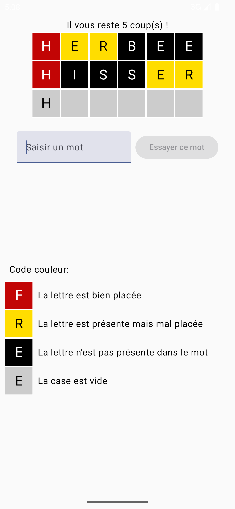
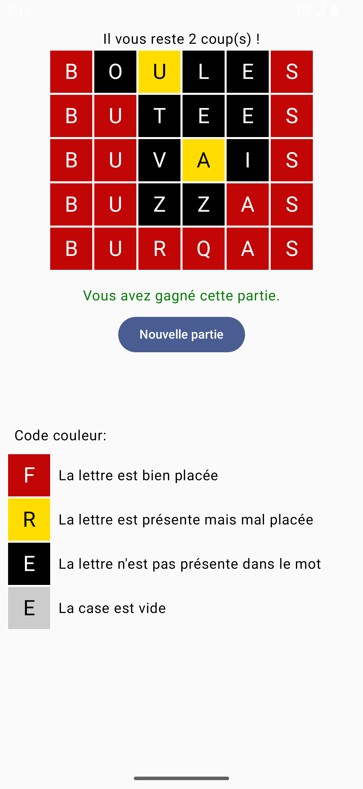
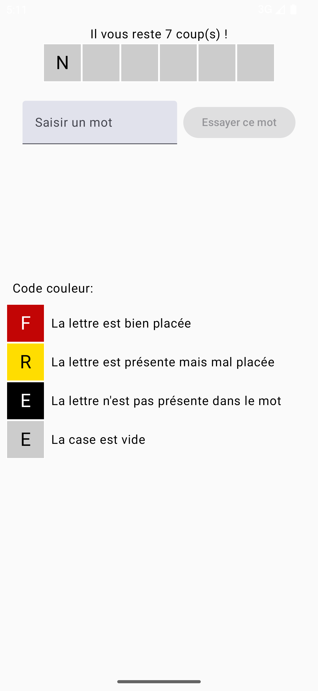
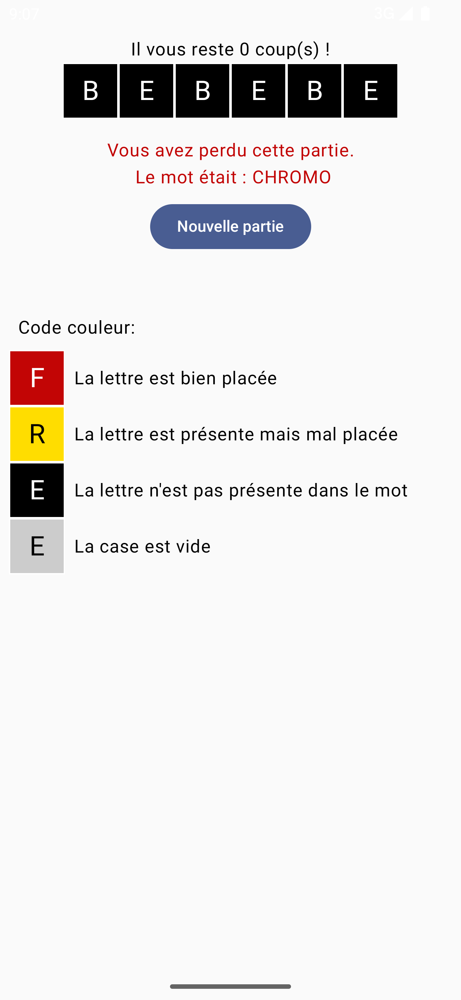
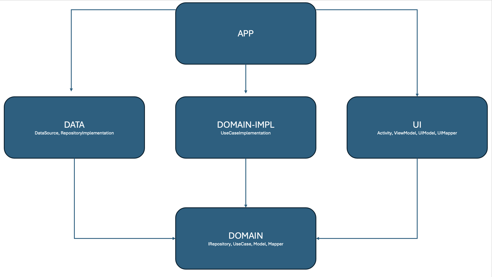

# Motus

Motus (en anglais : Lingo) est un jeu télévisé français d'origine américaine, diffusé sur Antenne 2 puis sur France 2 du 25 juin 1990 au 31 août 2019 et présenté par Thierry Beccaro.

Ce projet reprend en partie les préceptes du jeu.

# Règles

Le but du jeu est de trouver le mot caché qui comporte 6 lettres ; la première lettre du mot mystère est affichée. Il faut trouver le mot en un minimum de coup sans dépasser les 7 tentatives, sinon la partie est perdue.

A chaque tentative les cases contenant les lettres seront colorées. Les lettres bien placées sont entourées de rouge, celles mal placées de jaune et celle n’existant pas dans le mot de noir. Les mots mal orthographiés ou absents du dictionnaire entraineront la défaite du joueur.

# Images

<p float="left">
  
  
  
  
</p>

# Architecture

Une architecture clean a été mise en place. Il s’agit d’une méthode ou philosophie de conception logicielle qui permet de séparer l’application en différentes couches. Elle se distingue par une organisation du code en différentes couches, chaque couche aura ses responsabilités de façon indépendante.

La structure mise en place permet de favoriser les dépendances vers l’intérieur où les couches externes (UI) dépendront des couches internes, mais jamais l’inverse.

Cette philosophie s’inspire de nombreuses années d’études concernant des approches similaires comme les principes SOLID (https://fr.wikipedia.org/wiki/SOLID_(informatique)) et l’architecture hexagonale (https://fr.wikipedia.org/wiki/Architecture_hexagonale)  par exemple. Ces approches prônent les séparations des responsabilités et la souplesse de conception.

L’architecture mise en place sur le projet Motus respecte ces préceptes. Voici ci-dessous un schéma de celle-ci : 

<p float="center">
  
</p>

# Librairies

Les librairies recommandées par Google pour le développement Android ont été utilisées sur ce projet.

## Coroutines

Pour écrire du code asynchrone, plusieurs possibilités existent depuis des années comme EventBus, RX, Coroutines, etc. Le choix des coroutines est logique aujourd’hui tant la solution est complète. Cette librairie permet notamment d’écrire du code asynchrone sur un thread différent du main thread.

## Retrofit

Cette librairie facilite l’accès à une API REST et permet de contacter n’importe quelle API afin de réaliser des opérations de type CRUD (Create, Read, Update, Delete).

## Hilt

Il s’agit d’une librairie d’injection de dépendances qui permet de réduire drastiquement l’injection manuelle d’une classe à une autre. Cela évite également d’avoir à construire ou initialiser chaque classe à la main.
KOIN est aussi une librairie d’injection de dépendances qui fait aussi très bien le travail en terme de librairie d’injection de dépendances, cependant sur un gros projet il est déconseillé d’utiliser cette librairie afin d’éviter des pertes de performance au build.

## Compose

Il s’agit de la solution jetpack. Google a mis en place une librairie remplaçant définitivement les fichiers XML pour la réalisation d’une interface utilisateur. Cette librairie simplifie et accélère la réalisation des interfaces utilisateurs sur Android.
Sortie en 2021, cette librairie est désormais totalement opérationnelle sur Android mobile.
Cependant cette librairie est encore en phase ALPHA sur AndroidTV et comporte encore de nombreux problèmes liés au focus.
Le choix de cette librairie doit donc se faire avec minutie lors de la réalisation d’un projet, notamment si l’application Android doit être portée aussi sur AndroidTV.

## Detekt

C’est une librairie d’analyse statique du code qui, bien configurée, permet d’améliorer la qualité du code. Cette librairie analyse le code statiquement pour ensuite permettre à l’utilisateur de découvrir et corriger les mauvaises pratiques de développement.
Pour exécuter Detekt sur le projet, il faut lancer la commande suivante :

```kotlin
./gradlew Detekt
```

## Ktlint

Tout comme Detekt, cette librairie analyse aussi statiquement le code. Cependant, contrairement à Detekt, Ktlint permet de garantir une cohérence de développement au sein d'un projet. La librairie corrige le style de code du projet qui va à l’encontre des directives de style du langage.
Pour exécuter Ktlint sur le projet, il existe deux commandes :

```kotlin
./gradlew KtlintCheck //(qui permet de vérifier statiquement le code sans le modifier)
    
./gradlew KtlintFormat //(qui permet de vérifier statiquement le code en appliquant les modifications)
```

# Aller plus loin

Pour aller plus loin avec plus de temps, il est possible d’améliorer la qualité, la robustesse ainsi que la testabilité de l’application.

## ScreenshotTest

L’intégration de ces screenshots test peut être mis en place sur le projet. Les screenshots test permettent de tester de bout en bout un écran lié à une fonctionnalité précise. Cette méthode consiste à capturer automatiquement un écran, puis à comparer le résultat avec une image attendue.
Ils existent plusieurs librairies qui permettent cela :

https://github.com/pedrovgs/Shot

https://github.com/cashapp/paparazzi


## JavaDoc

JavaDoc est un outil du JDK qui permet de produire des documentations sous forme de code HTML à partir du code source du projet. Cette documentation permet aux autres développeurs et/ou utilisateurs de ne pas avoir à se plonger dans le code pour s’assurer d’avoir compris son fonctionnement, ou que le code réponde à leurs besoins. En bonus elle permet aussi de se relire.

## SonarQube

C’est un outil permettant l’inspection continue de la qualité du code d’un projet. Des rapports détaillés sont fournis sur les problèmes de code, les bugs et les vulnérabilités de sécurités potentielles.

## CI/CD

Les pipelines CI/CD permettent de générer, tester et déployer automatiquement le code du projet. C’est une garantie qui permet de savoir que le code est toujours prêt à être envoyer en production. De plus les pipelines permettent aussi d’assurer aux développeurs/reviewer sur des MR où PR lors du développement d’une fonctionnalité, que celles-ci respectent les normes du projet, les contraintes de qualités et les non-régressions.
Par exemple, des outils tels que SonarQube, Ktlint, Detekt, Shot ou bien Paparazzi peuvent facilement être intégrés sur une chaîne d’intégration continue visant à garantir la qualité, la lisibilité, la maintenabilité et la performance du projet et de l’application.
